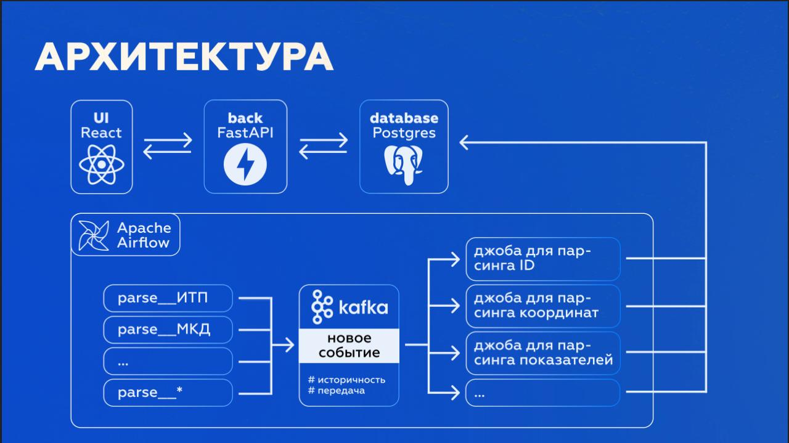

# ЛЦТ 2025 x dorateam

### Задача
Интерактивный электронный журнал общего строительного контроля

### Рабочий прототип
[Ссылка](http://5.129.195.176/)

### Архитектура решения


### Документация API
[Cсылка](http://5.129.195.176:8080/docs#/)

### Figma
[Ссылка](https://www.figma.com/design/kPoOgld8k9c0Xb3f0FrwXb/%D0%9B%D0%A6%D0%A2-25?node-id=0-1&t=RjEp0QDGrisLfiKw-1)

### Презентация
[Ссылка](https://disk.yandex.ru/d/chfOVJ8LCqdl4w)

### Запуск Backend
```bash
cd backend
docker compose up --build -d
```

### Запуск Frontend
```bash
cd frontend
npm install
npm start
```

### Авторство
dorateam, 2025